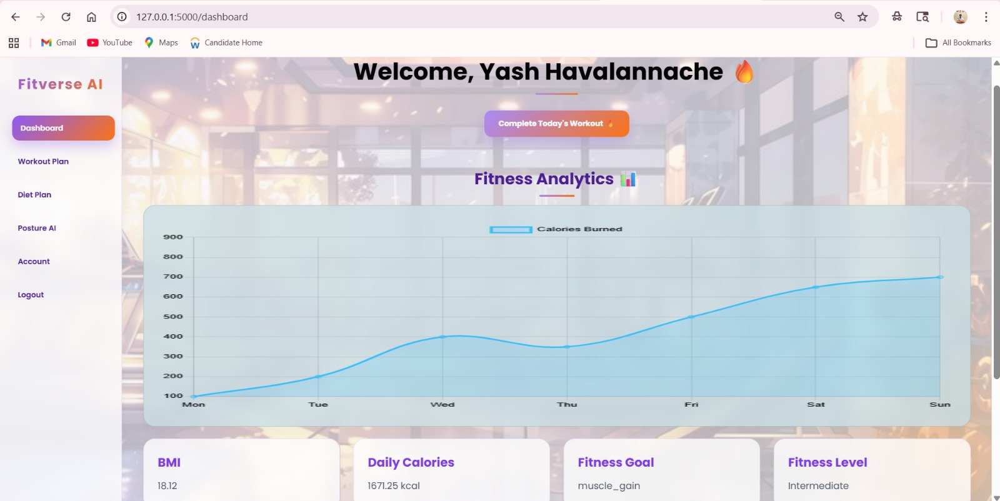
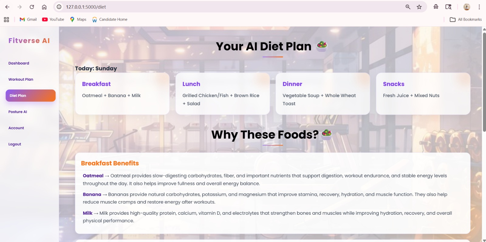

# 🏋️ AI Fitness Trainer

The AI Fitness Trainer is a smart, web-based fitness assistant designed to help users build a healthier, more disciplined lifestyle. It works like a personal workout companion that simplifies fitness planning and removes the confusion of deciding what to do each day.

Instead of randomly selecting workouts or struggling with motivation, users get a structured and guided fitness experience that keeps them consistent and helps them progress step by step.

This project combines web development technologies like Flask, HTML, and CSS with intelligent logic to simulate a personalized fitness journey. Its main goal is to make fitness more accessible, especially for students and busy individuals who often find it difficult to maintain a consistent workout routine.


---

<!-- ## 🌟 Live Preview (Optional)
> Add your deployed link here later  
`https://your-live-app-link.com` -->


## Screenshots

###  Home Page + Dashboard

| | |
|--|--|
|  |  |

---

### Login + Register

| | |
|--|--|
|  |  |

---

### Diet Plan + Workout

| | |
|--|--|
|  |  |

##  Features

- 🧠 AI-based workout suggestions
- 📊 Progress tracking system
- 🔐 Secure login & registration system
- 💪 Workout plans for different muscle groups
- 🎨 Modern responsive UI design
- 📱 Mobile-friendly layout
- 🧾 Clean and minimal user experience

---

##  Tech Stack

- Frontend: HTML, CSS, JavaScript
- Backend: Flask (Python)
- Database: SQLite (or your DB if used)
- Styling: Custom CSS (Glassmorphism UI)

---

## 📁 Project Structure
```
AI-Fitness-Trainer/
│
├── static/
│ ├── images/
│ ├── css/
│
├── templates/
│ ├── index.html
│ ├── login.html
│ ├── register.html
│ ├── workout.html
│
├── app.py
├── README.md
```


---

## 🚀 How to Run Locally

# Clone the repository
git clone https://github.com/yashhavalannache/AI-Fitness-Trainer.git

# Move into project folder
cd AI-Fitness-Trainer

# Install dependencies
pip install -r requirements.txt

# Run the app
python app.py


---
