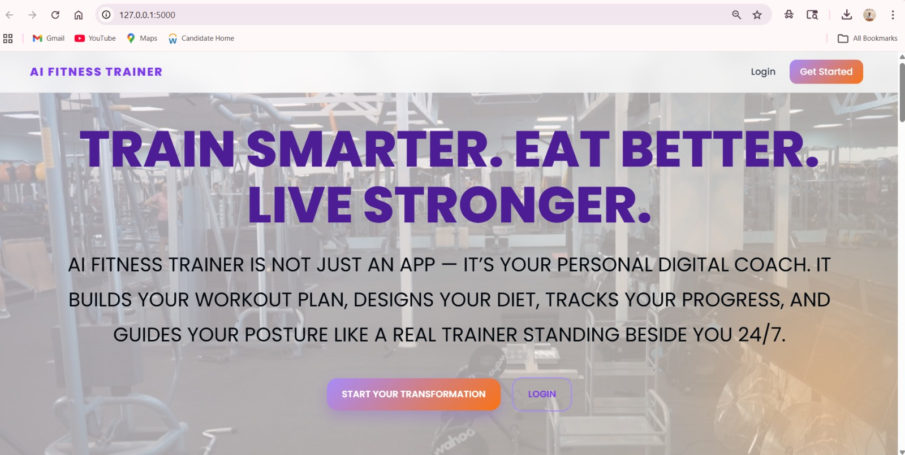
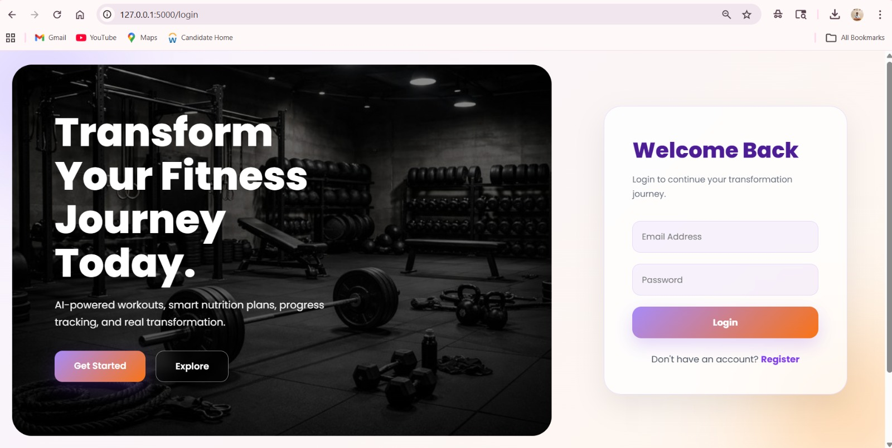
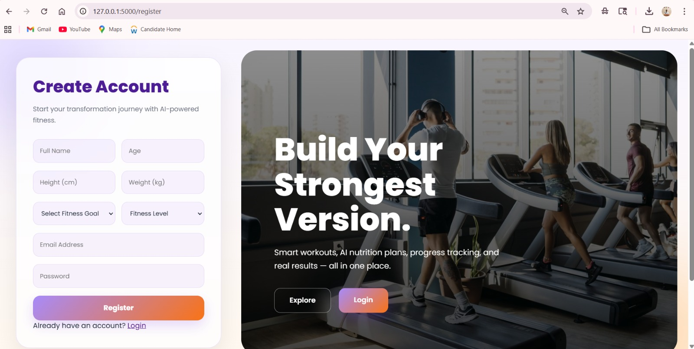
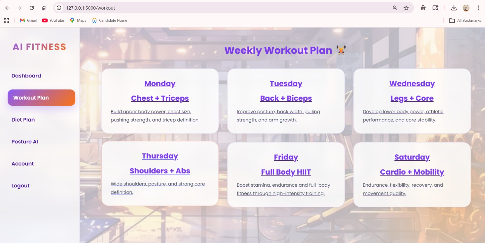

# 🏋️ AI Fitness Trainer

The AI Fitness Trainer is a smart web-based fitness assistant designed to guide users in building a healthier and more disciplined lifestyle. It acts like a personal workout companion that removes confusion from fitness planning and makes exercise simple, structured, and consistent.

Instead of randomly choosing workouts or struggling to stay motivated, users get a guided fitness experience that helps them stay on track and improve step by step.

This project combines web development (Flask, HTML, CSS) with intelligent logic to simulate a personalized fitness journey. The goal is to make fitness more accessible, especially for students and busy individuals who find it difficult to maintain a routine.

🌟 Vision of the Project
The main idea behind this app is simple:
“Fitness should not feel complicated — it should feel natural, guided, and motivating.”
---

<!-- ## 🌟 Live Preview (Optional)
> Add your deployed link here later  
`https://your-live-app-link.com` -->

---

## Screenshots

### 🏠 Home Page (Index)
<p align="center">
  
  
</p>

### 📝 Register + 💪 Workout
<p align="center">
  
  
</p>

##  Features

- 🧠 AI-based workout suggestions
- 📊 Progress tracking system
- 🔐 Secure login & registration system
- 💪 Workout plans for different muscle groups
- 🎨 Modern responsive UI design
- 📱 Mobile-friendly layout
- 🧾 Clean and minimal user experience

---

##  Tech Stack

- Frontend: HTML, CSS, JavaScript
- Backend: Flask (Python)
- Database: SQLite (or your DB if used)
- Styling: Custom CSS (Glassmorphism UI)

---

## 📁 Project Structure
```
AI-Fitness-Trainer/
│
├── static/
│ ├── images/
│ ├── css/
│
├── templates/
│ ├── index.html
│ ├── login.html
│ ├── register.html
│ ├── workout.html
│
├── app.py
├── README.md
```


---

## 🚀 How to Run Locally

# Clone the repository
git clone https://github.com/yashhavalannache/AI-Fitness-Trainer.git

# Move into project folder
cd AI-Fitness-Trainer

# Install dependencies
pip install -r requirements.txt

# Run the app
python app.py


---
